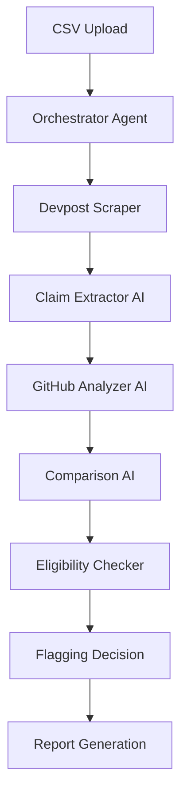

# hackID - AI-Powered Hackathon Verification System

An autonomous multi-agent system that verifies hackathon submissions by analyzing Devpost projects and GitHub repositories to detect discrepancies and validate eligibility.

## 🎯 Project Vision

Hackathon organizers receive hundreds of submissions. Manually reviewing each project's code, commit history, and claimed features is time-consuming and error-prone. **hackID** automates this process using AI agents to:

1. ✅ Extract claims from Devpost submissions
2. ✅ Analyze GitHub repositories
3. ✅ Compare claimed features vs actual code
4. ✅ Validate commit timings for eligibility
5. ✅ Flag suspicious projects for manual review

## 🏗️ System Architecture



### Agent Roles

| Agent | Responsibility |
|-------|----------------|
| **Orchestrator** | Coordinates workflow and agent communication |
| **Devpost Scraper** | Extracts project data from Devpost pages |
| **Claim Extractor** | Uses LLM to identify technical claims and features |
| **GitHub Analyzer** | Analyzes code, tech stack, and commit history |
| **Comparison Agent** | Validates claims against actual code |
| **Eligibility Checker** | Verifies commits are within hackathon dates |
| **Flagging Decision** | Determines if manual review is needed |

## 🚀 Getting Started

The project is currently in **Phase 2**, featuring a fully functional multi-agent verification pipeline powered by **Google Gemini**.

### 📦 Installation

1. **Clone the repository**
   ```bash
   git clone <your-repo-url>
   cd hackID
   ```

2. **Quick Setup (Windows)**
   Run the included setup script to prepare your environment:
   ```powershell
   ./setup.ps1
   ```

3. **Configure API Keys**
   Edit the `.env` file and add your keys:
   ```env
   GOOGLE_API_KEY=your_gemini_key
   GITHUB_TOKEN=your_token_optional
   ```

### 🧪 Running Validation

To validate a hackathon project gallery:
```bash
$env:PYTHONPATH="backend"
python backend/pipeline.py gallery <devpost_gallery_url> --max 5
```

---

## 🏗️ System Architecture

HackID uses a two-agent structure coordinated by a central pipeline:

1. **Claim Extractor (Agent 1)**: Analyzes Devpost stories using AI to extract structured claims with **importance weights** (Core, Secondary, Minor).
2. **GitHub Validator (Agent 2)**: 
   - **Tier 1**: Fast API-based checks for files and commit history.
   - **Tier 2**: AI-powered code deep-dives to verify complex logic without cloning.

### ⚖️ Decision Logic
- **Verified**: All core technical requirements met.
- **Flagged**: Missing **Core** technologies (weight 1.0).
- **Disqualified**: Hard timeline violations (commits made before start).

---

## 🗺️ Roadmap

### ✅ Phase 1: Prototype (COMPLETE)
- [x] Devpost scraper & JSON output

### ✅ Phase 2: Agentic Verification (COMPLETE)
- [x] Gemini-powered claim extraction
- [x] Weighted technology importance
- [x] AI deep-dive GitHub validation (no cloning)
- [x] Normalized PostgreSQL/VertexAI detection
- [x] Optimized performant pipeline CLI

### 📋 Phase 3: Integration (NEXT)
- [ ] Supabase data ingestion
- [ ] Batch processing from CSV
- [ ] Advanced report generation

### 📋 Phase 3: CSV Processing
- [ ] Batch processing from CSV
- [ ] Progress tracking
- [ ] Error handling

### 🌐 Phase 4: Web Interface
- [ ] Flask/FastAPI backend
- [ ] Upload CSV interface
- [ ] Real-time progress display
- [ ] Download flagging report

## 🔧 Technical Details

### How Devpost Scraping Works

The scraper uses BeautifulSoup to parse HTML and extract:

1. **Title**: From `<h1 id="app-title">`
2. **Story Sections**: Parses `<h2>` headers and associated `<p>` tags
3. **Tech Stack**: Extracts `<span class="cp-tag">` elements
4. **GitHub Link**: Searches for links containing "github.com"
5. **Team**: Parses `<div id="app-team">` section

### Why This Approach?

- **No API required**: Devpost doesn't have a public API
- **Robust**: Uses multiple selectors to handle different page layouts
- **Structured data**: Organizes story into sections for easier AI analysis
- **Complete**: Captures all metadata needed for verification

## 🤖 How AI Agents Will Work (Phase 2)

### Claim Extraction
```python
# Example: LLM extracts structured claims
claims = {
    "technologies": ["TensorFlow", "React", "Raspberry Pi"],
    "features": [
        "Computer vision for hand washing detection",
        "Real-time LED feedback",
        "Web dashboard for compliance tracking"
    ],
    "complexity_claims": ["First time using Raspberry Pi"]
}
```

### GitHub Analysis
```python
# Agent analyzes actual code
analysis = {
    "detected_languages": ["Python", "JavaScript", "C++"],
    "frameworks_used": ["TensorFlow", "React"],
    "commit_timeline": [...],
    "lines_of_code": 2500
}
```

### Comparison
```python
# Agent compares claims vs reality
verification = {
    "tech_match": True,  # TensorFlow, React confirmed
    "features_validated": ["Computer vision present", "React dashboard exists"],
    "red_flags": ["80% of code committed before hackathon start"]
}
```

## 📊 Expected Workflow

1. **Upload CSV**: `participant_name, devpost_url, hackathon_dates`
2. **Scrape**: Extract all project data
3. **Extract Claims**: LLM identifies what team claims they built
4. **Analyze GitHub**: Get actual code and commit history
5. **Compare**: Validate claims against reality
6. **Check Eligibility**: Ensure commits are within hackathon timeframe
7. **Flag**: Output projects needing manual review

## 🤝 Contributing

This is currently a prototype. Contributions welcome for:
- Additional Devpost parsing edge cases
- GitHub API integration
- LangChain multi-agent implementation
- Testing with more hackathons

## 📄 License

MIT License - Feel free to use for your hackathon!

## 🙏 Acknowledgments

Built with inspiration from real hackathon challenges. Tested on DeltaHacks 12 projects.
