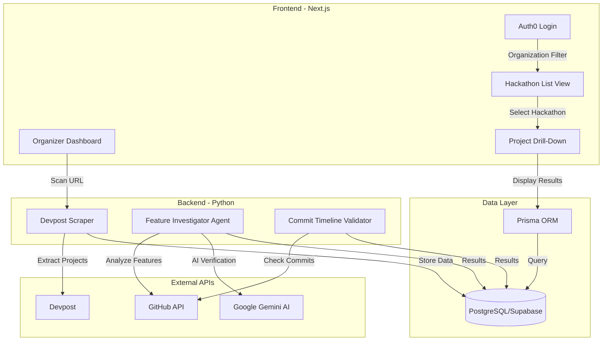

# .gitcheck

**Automated Integrity Verification for Hackathons**

.gitcheck is an integrity engine that validates hackathon projects. We cross-reference Devpost claims with GitHub history to confirm correct commit timelines and verify that features actually exist.

---

## 🎯 The Problem

Hackathon organizers receive hundreds of submissions but have no way to verify:
- Was this code actually written during the event?
- Do the claimed features exist in the repository?
- Are teams submitting pre-existing projects?

Manual verification is impossible at scale. **That's where .gitcheck comes in.**

---

## 🏗️ System Architecture



---

## 🔍 How It Works

### 1. **Devpost Scraping**
The Python scraper (`scrape_hackathon.py`) extracts:
- Project titles, taglines, descriptions
- Team members
- Technologies used
- GitHub repository links
- Hackathon schedule (start/end times)

### 2. **Dual Verification System**

#### **Part A: Feature Verification**
The **Feature Investigator Agent** (powered by Google Gemini):
1. Reads the Devpost description
2. Extracts claimed features using AI
3. Analyzes the GitHub repository structure
4. Cross-references claimed features with actual code
5. Assigns a validity score

#### **Part B: Commit Timeline Validation**
The **Commit Timeline Validator**:
1. Fetches all commits from the GitHub repository
2. Compares commit timestamps with hackathon start/end times
3. Flags projects with commits outside the event window
4. Detects pre-existing code patterns

### 3. **Organization-Based Access Control**
- Organizers log in via Auth0
- Each user is assigned an `organization` (e.g., "DeltaHacks", "HackTheNorth")
- Users only see hackathons belonging to their organization
- Ensures data isolation and multi-tenant support

---

## 🚀 Tech Stack

### **Frontend** (`/hackid-front`)
- **Framework**: Next.js 15 (App Router)
- **Language**: TypeScript
- **Styling**: TailwindCSS (Brutalist Design)
- **Auth**: Auth0 with organization-based filtering
- **Database**: Prisma ORM → PostgreSQL (Supabase)

### **Backend** (`/backend`)
- **Language**: Python 3.x
- **Scraping**: BeautifulSoup4, Requests
- **AI**: Google Gemini API
- **GitHub Integration**: GitHub REST API

### **Database**
- **Provider**: Supabase (PostgreSQL)
- **Schema**:
  - `hackathons`: Stores hackathon metadata (name, dates, org_id)
  - `projects`: Stores project data, GitHub links, and verification results

---

## 📦 Installation

### Prerequisites
- Node.js 18+ and npm
- Python 3.10+
- PostgreSQL database (or Supabase account)
- Auth0 account
- Google Gemini API key
- GitHub Personal Access Token (optional, for higher rate limits)

### 1. Clone the Repository
```bash
git clone https://github.com/yourusername/gitcheck.git
cd gitcheck
```

### 2. Backend Setup
```bash
# Create virtual environment
python -m venv venv
source venv/bin/activate  # On Windows: venv\Scripts\activate

# Install dependencies
pip install -r requirements.txt

# Configure environment variables
cp .env.example .env
# Edit .env and add:
# - GOOGLE_API_KEY
# - GITHUB_TOKEN (optional)
# - DATABASE_URL
```

### 3. Frontend Setup
```bash
cd hackid-front

# Install dependencies
npm install

# Configure environment variables
cp .env.example .env.local
# Edit .env.local and add:
# - AUTH0_DOMAIN
# - AUTH0_CLIENT_ID
# - AUTH0_CLIENT_SECRET
# - AUTH0_SECRET
# - APP_BASE_URL
# - DATABASE_URL

# Generate Prisma client
npx prisma generate

# Run database migrations
npx prisma db push

# Start development server
npm run dev
```

---

## 🎮 Usage

### Scraping a Hackathon
```bash
python scrape_hackathon.py https://deltahacks-12.devpost.com/ --max-projects 50
```

### Running the Frontend
```bash
cd hackid-front
npm run dev
```
Visit `http://localhost:3000` and log in with your Auth0 credentials.

### Setting Up Organizations in Auth0
1. Go to **Auth0 Dashboard → User Management → Users**
2. Select your user
3. Edit `app_metadata` and add:
   ```json
   {
     "organization": "your-org-id"
   }
   ```
4. The `org_id` must match the `org_id` in your `hackathons` table

---

## 🗺️ Roadmap

### ✅ Completed
- [x] Devpost scraper with schedule extraction
- [x] Next.js frontend with brutalist design
- [x] Auth0 authentication with domain verification
- [x] Organization-based hackathon filtering
- [x] PostgreSQL database with Prisma ORM
- [x] Drill-down navigation (Hackathons → Projects)

### 🚧 In Progress
- [ ] Feature Investigator Agent (AI-powered)
- [ ] Commit timeline validation
- [ ] Automated verdict assignment (Valid/Invalid/Flagged)

### 📋 Planned
- [ ] Real-time scanning from frontend
- [ ] Batch processing API
- [ ] Detailed project analysis reports
- [ ] Export results to CSV
- [ ] Admin dashboard for multi-org management

---

## 🤝 Contributing

This project was built for hackathons, by hackathon organizers. Contributions are welcome!

### Team
- **Karl Andres** - Co-Founder
- **Krish Bhagirath** - Co-Founder
- **Kajuran Elanganathan** - Co-Founder

---

## 📄 License

MIT License - Feel free to use this for your hackathon!

---

## 🙏 Acknowledgments

Built with inspiration from real hackathon challenges. Tested on DeltaHacks 12 and other major hackathons.

**Tagline**: *Verify the Code. Check the Features. Validate the Win.*
